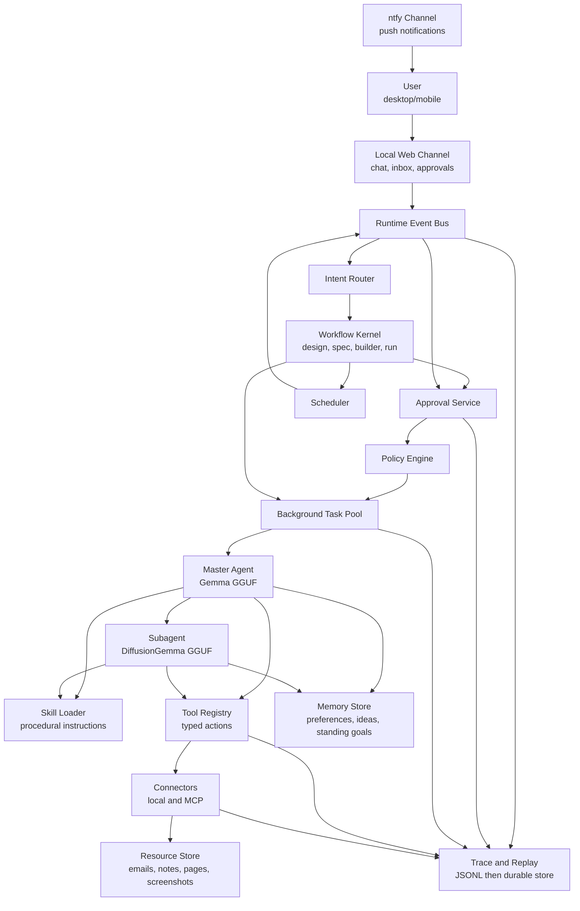
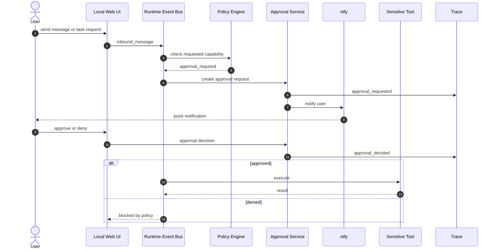
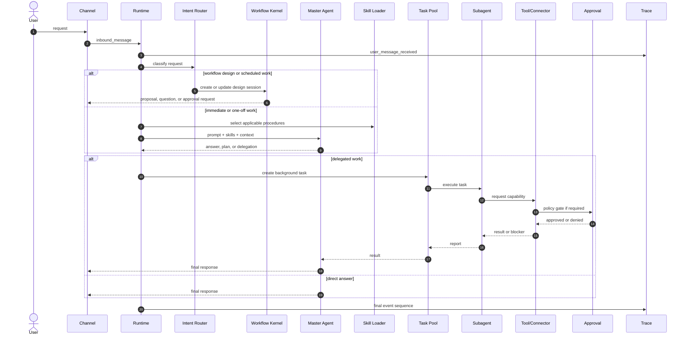
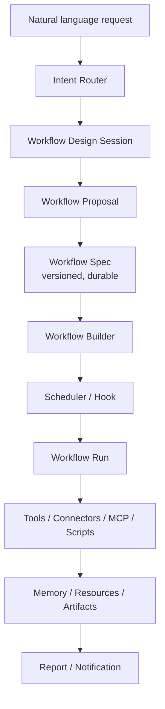
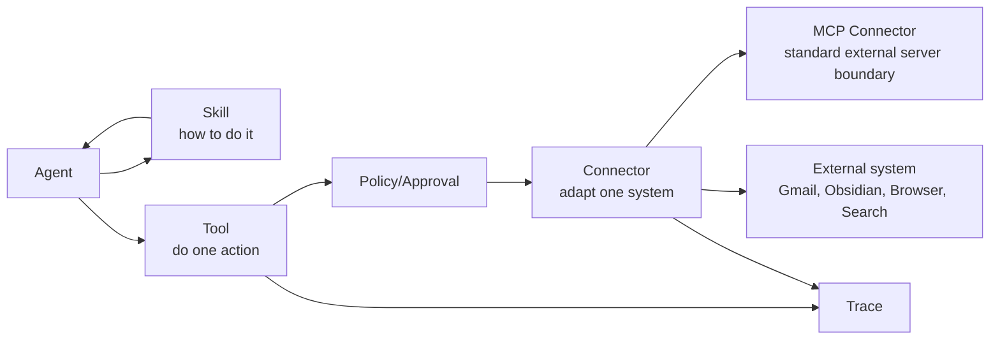
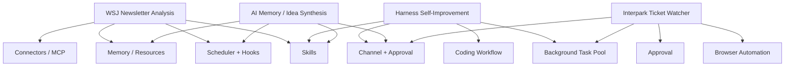
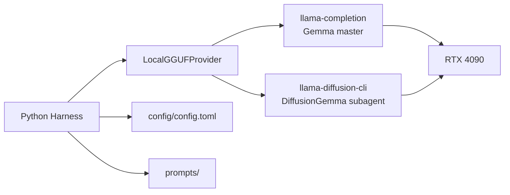

# Architecture

This harness is a personal local-first agent runtime. The implementation should stay small, but the concepts need to be explicit enough to support 24/7 work.

The system should grow around a narrow core:

```text
message/event -> intent/workflow -> policy/approval -> task runtime -> agent loop -> tools/connectors -> trace/memory
```

## System Map



## User Communication

The first extension primitive is the user communication and approval surface.



The local web channel is the simplest control plane: chat, approval cards, task status, and logs. ntfy is the low-friction mobile notification layer. Mobile reply can start as "tap notification, open web page" before implementing a richer mobile chat channel.

## Runtime Loop



## Primitive Boundaries

| Module | Owns | Does not own |
| --- | --- | --- |
| Channel | user messages, notifications, approval UI | model reasoning, tool logic |
| Intent Router | classify user requests into work classes | executing workflows |
| Workflow Kernel | design sessions, workflow specs, lifecycle, builder, run orchestration | connector implementation details |
| Approval | approval lifecycle and decision records | deciding task strategy |
| Policy | capability rules and safety gates | executing tools |
| Scheduler | time-based event creation | long-running execution internals |
| Task Pool | lifecycle, heartbeats, cancellation, recovery | skill content |
| Agent | planning, delegation, reporting | direct external side effects |
| Skill | procedural guidance and routing metadata | executable side effects |
| Tool | one typed executable action | workflow strategy |
| Connector | external system boundary and capability exposure | business workflow logic |
| MCP Connector | standard MCP server/client adapter | local provider abstraction |
| Memory | durable user context and internal records | raw external source of truth |
| Resource Store | external artifacts and references | user preference policy |
| Trace | event history and replay | operational decisions |

## Workflow Kernel

The Workflow Kernel is the framework layer that prevents the project from becoming a set of bespoke apps.



Rules:

- Workflow specs are data-first and persisted.
- Workflow steps own control flow; agents provide intelligence inside steps.
- Generated scripts are artifacts and require admission before execution.
- Use cases such as newsletters, social trends, browser watchers, coding, and idea synthesis are probes for the same workflow kernel.

## Tool, Connector, MCP, Skill



Rules of thumb:

- Use a skill when the reusable part is "how to perform a class of work."
- Use a tool when the reusable part is "perform one typed action."
- Use a connector when the reusable part is "talk to this outside system."
- Use MCP when that connector benefits from a separate server/process, capability discovery, or reuse by other clients.
- Use a hook when work begins because an event happened.
- Use a scheduler when work begins because time passed.
- Use a background task when work must continue after the current chat turn.

## Use Case Mapping



## Local Model Runtime

The model runtime remains intentionally narrow:



Do not add multi-provider routing until the local harness proves useful.
