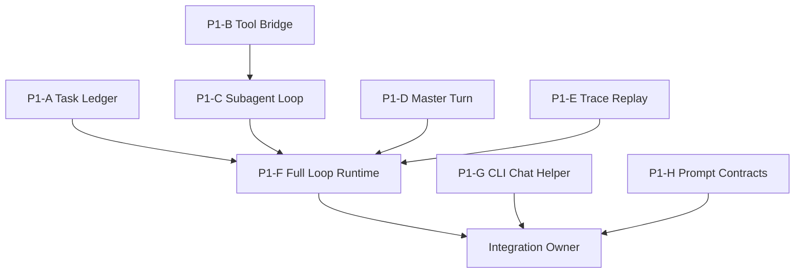

# Phase 1 Plan: Minimal Full Loop

Status: complete. See `docs/legacy/phase1_status.md` for verification results.

Phase 1의 목표는 "작지만 진짜 agent harness"를 만드는 것이다.

Phase 0은 부품 검증이었다. Phase 1은 아래 한 회로가 끝까지 도는지 증명한다.

```text
User
 -> Master Agent
    -> decides direct/delegate
    -> creates SubAgentTask when needed
       -> Sub Agent
          -> emits tool call JSON
          -> tool executes
          -> reports result
    -> Master final response
 -> User
```

이 프로젝트는 개인용 로컬 harness다. Phase 1에서도 multi-provider, marketplace, provider discovery, remote backend, plugin framework는 만들지 않는다.

## Phase 1 Acceptance

Input:

```text
1+1은 뭐지?
```

Expected final:

```text
2
```

Expected trace events:

```text
user_message_received
master_model_called
master_delegation_decision
subagent_task_created
subagent_model_called
tool_called:add
tool_result:add
subagent_reported
master_final_answer
```

The full-loop eval must verify:

- final answer contains `2`
- trace contains the expected event types in order
- task reaches `completed`
- tool result is captured as structured data
- malformed model output has a controlled failure path

## Implementation Principles

- Keep `LocalGGUFProvider` as the only model provider.
- Keep model invocation as CLI subprocesses for Phase 1.
- Keep task state in memory and event trace in JSONL.
- Do not add persistence beyond JSONL trace.
- Do not add new real tools beyond `add(a, b)`.
- Use the model runner's official GGUF chat template path where available.
- Python owns orchestration, task state, tool schemas, parsing, and tracing.

## Target Modules

```text
agentic/
  runtime/
    turn.py              Master turn orchestration
    subagent_loop.py     Subagent execution loop
    tool_bridge.py       Tool-call execution bridge
    full_loop.py         User-message to final-answer loop
    failures.py          Failure result objects and retry policy v0
  tasks/
    ledger.py            In-memory task ledger
  traces/
    replay.py            Trace replay/assertion helpers
  app/
    chat.py              Interactive CLI chat entrypoint helper

evals/
  test_phase1_*.py       Focused module and vertical-slice tests

prompts/
  master_phase1.md       Phase 1 master prompt
  subagent_phase1.md     Phase 1 subagent prompt
```

## Non-Overlapping Parallel Work Packages

These packages are designed so multiple Codex Agents can work at the same time without editing the same files. Each worker should stay inside its owned file list.

### P1-A: Task Ledger And State Semantics

Goal: make task lifecycle observable and easy for the runtime to update.

Owned files:

```text
agentic/tasks/ledger.py
evals/test_phase1_task_ledger.py
```

May read:

```text
agentic/tasks/subagent_task.py
agentic/traces/logger.py
docs/legacy/phase1_plan.md
```

Must not edit:

```text
agentic/tasks/subagent_task.py
agentic/runtime/*
agentic/app/*
```

Deliverables:

- `TaskLedger`
- create/get/list task APIs
- state transition helper around existing `SubAgentTask`
- optional trace recording hook

Acceptance:

- can create a task from instruction
- can transition through `created -> running -> tool_requested -> tool_completed -> reported -> completed`
- invalid task id fails clearly
- invalid state transition still fails through existing task rules

Suggested tests:

```text
test_ledger_creates_task
test_ledger_gets_task_by_id
test_ledger_records_state_transition
test_ledger_rejects_unknown_task
```

### P1-B: Tool Execution Bridge

Goal: connect parsed model tool-call JSON to `ToolRegistry.execute`.

Owned files:

```text
agentic/runtime/tool_bridge.py
evals/test_phase1_tool_bridge.py
```

May read:

```text
agentic/tools/parser.py
agentic/tools/registry.py
agentic/traces/logger.py
docs/legacy/phase1_plan.md
```

Must not edit:

```text
agentic/tools/*
agentic/runtime/full_loop.py
agentic/runtime/subagent_loop.py
```

Deliverables:

- `ToolExecutionResult`
- `ToolBridge.execute_tool_call_text(text)`
- trace events for `tool_called:{name}` and `tool_result:{name}`
- controlled error result for malformed JSON or unknown tool

Acceptance:

- parses `{"tool":"add","arguments":{"a":1,"b":1}}`
- returns result `2`
- records trace events
- malformed JSON returns/raises a typed controlled failure, not an unstructured exception leak

Suggested tests:

```text
test_bridge_executes_add_tool
test_bridge_records_tool_trace
test_bridge_handles_malformed_json
test_bridge_handles_unknown_tool
```

### P1-C: Subagent Execution Loop

Goal: run one subagent task until it reports a result or a controlled failure.

Owned files:

```text
agentic/runtime/subagent_loop.py
evals/test_phase1_subagent_loop.py
```

May read:

```text
agentic/agents/subagent.py
agentic/models/local_gguf.py
agentic/prompts/builder.py
agentic/tasks/subagent_task.py
agentic/tools/registry.py
docs/legacy/phase1_plan.md
```

Must not edit:

```text
agentic/agents/*
agentic/runtime/tool_bridge.py
agentic/runtime/full_loop.py
prompts/*
```

Deliverables:

- `SubagentLoop`
- one-shot execution method for a `SubAgentTask`
- states: `running`, `tool_requested`, `tool_completed`, `reported`, `completed` or `failed`
- dependency injection for provider/agent/tool bridge
- fake-provider friendly tests

Acceptance:

- given fake subagent output containing tool-call JSON, calls the tool bridge
- stores subagent report/result on task
- emits trace events `subagent_model_called`, `subagent_reported`
- handles malformed output as `failed`

Suggested tests:

```text
test_subagent_loop_executes_tool_call
test_subagent_loop_marks_task_completed
test_subagent_loop_records_trace
test_subagent_loop_marks_failed_on_bad_tool_call
```

### P1-D: Master Turn Planning

Goal: represent master output as either direct answer or delegation request.

Owned files:

```text
agentic/runtime/turn.py
evals/test_phase1_master_turn.py
```

May read:

```text
agentic/agents/master.py
agentic/models/local_gguf.py
agentic/models/response_sanitizer.py
agentic/prompts/builder.py
docs/legacy/phase1_plan.md
```

Must not edit:

```text
agentic/agents/*
agentic/runtime/full_loop.py
prompts/*
```

Deliverables:

- `MasterDecision`
- `MasterTurn`
- parser for simple structured master decisions
- fallback heuristic for Phase 1 test: arithmetic questions can delegate to subagent

Recommended decision format:

```json
{"action":"delegate","task":"Use add tool to compute 1+1."}
```

or:

```json
{"action":"answer","answer":"..."}
```

Acceptance:

- parses valid `answer` decision
- parses valid `delegate` decision
- creates a fallback delegation for `1+1은 뭐지?` if model output is not structured
- records `master_model_called` and `master_delegation_decision`

Suggested tests:

```text
test_master_decision_parses_answer
test_master_decision_parses_delegate
test_master_turn_delegates_simple_addition
test_master_turn_records_trace
```

### P1-E: Trace Replay And Full-Loop Assertions

Goal: make end-to-end traces easy to verify.

Owned files:

```text
agentic/traces/replay.py
evals/test_phase1_trace_replay.py
```

May read:

```text
agentic/traces/logger.py
docs/legacy/phase1_plan.md
```

Must not edit:

```text
agentic/runtime/*
agentic/traces/logger.py
```

Deliverables:

- load JSONL trace events
- event type filtering
- ordered event assertion helper
- last-event lookup helper

Acceptance:

- can read a trace written by `TraceLogger`
- can assert expected ordered subsequence
- clear assertion failure when an event is missing or out of order

Suggested tests:

```text
test_replay_loads_events
test_replay_filters_by_type
test_replay_asserts_ordered_events
test_replay_reports_missing_event
```

### P1-F: Full Loop Runtime Integration

Goal: wire the pieces together after P1-A through P1-E land.

Owned files:

```text
agentic/runtime/full_loop.py
evals/test_phase1_full_loop.py
```

May read:

```text
agentic/runtime/turn.py
agentic/runtime/subagent_loop.py
agentic/runtime/tool_bridge.py
agentic/tasks/ledger.py
agentic/traces/replay.py
agentic/config/settings.py
docs/legacy/phase1_plan.md
```

Must not edit initially:

```text
agentic/app/cli.py
config/config.toml
prompts/*
```

Deliverables:

- `FullLoopRuntime`
- `run_user_message(message) -> final answer/result`
- fake model path for deterministic tests
- trace event sequence matching Phase 1 acceptance

Acceptance:

- deterministic fake full-loop test passes for `1+1은 뭐지?`
- final answer contains `2`
- task is completed
- trace includes required event order

Suggested tests:

```text
test_full_loop_answers_addition_with_fake_models
test_full_loop_trace_contains_expected_events
test_full_loop_returns_failure_result_on_subagent_failure
```

### P1-G: CLI Chat Entrypoint

Goal: expose the full loop through a simple CLI command after integration exists.

Owned files:

```text
agentic/app/chat.py
evals/test_phase1_chat_cli.py
```

May read:

```text
agentic/app/cli.py
agentic/runtime/full_loop.py
agentic/config/settings.py
docs/legacy/phase1_plan.md
```

Must not edit until integration window:

```text
agentic/app/cli.py
```

Deliverables:

- `run_chat_once(config, message)`
- simple REPL helper function
- tests for chat helper without real model execution

Acceptance:

- can call `run_chat_once` with fake runtime/provider
- output string is returned
- no real GGUF model is required for default tests

Integration note:

After P1-F and P1-G land, one integration owner may add a `chat` or `ask` subcommand to `agentic/app/cli.py`.

### P1-H: Prompt Contracts

Goal: prepare Phase 1 prompt files without touching runtime code.

Owned files:

```text
prompts/master_phase1.md
prompts/subagent_phase1.md
docs/legacy/phase1_prompt_contract.md
```

May read:

```text
prompts/master.md
prompts/subagent.md
prompts/tool_call_grammar.md
docs/legacy/phase1_plan.md
```

Must not edit:

```text
prompts/master.md
prompts/subagent.md
config/config.toml
agentic/*
```

Deliverables:

- master decision contract
- subagent tool-call contract
- examples for direct answer, delegate, add tool call, report

Acceptance:

- prompts are short enough for the current context settings
- prompt contract includes exact JSON examples
- no config changes yet

Integration note:

Only the final integration owner should switch `config/config.toml` to use these prompts.

## Integration Owner Package

The integration owner should run after P1-A through P1-H are merged.

Owned files during integration only:

```text
agentic/app/cli.py
config/config.toml
README.md
docs/legacy/phase1_status.md
docs/architecture.md
```

Responsibilities:

1. Add `ask` or `chat` CLI subcommand.
2. Wire `FullLoopRuntime` into CLI.
3. Switch config to Phase 1 prompt files if P1-H is ready.
4. Run default tests.
5. Run opt-in real-model smoke only if GPU is available.
6. Update docs with final commands and known caveats.

## Dependency Graph



Parallel-safe start set:

```text
P1-A, P1-B, P1-D, P1-E, P1-G, P1-H
```

Start after dependencies:

```text
P1-C after P1-B
P1-F after P1-A, P1-C, P1-D, P1-E
Integration Owner after P1-F, P1-G, P1-H
```

## Coordination Rules For Multiple Codex Agents

1. Each Agent must edit only its owned files.
2. If a package needs a shared API change, document the needed change in its final report instead of editing another package's files.
3. Do not edit `agentic/app/cli.py`, `config/config.toml`, or existing prompt files unless assigned as integration owner.
4. Do not run real GGUF tests by default; use fake providers unless explicitly validating integration.
5. Do not start multiple real-model GPU tests in parallel.
6. Add focused tests in the owned `evals/test_phase1_*.py` file.
7. Keep imports stable and avoid circular imports from `agentic/runtime/*`.

## Suggested Agent Prompts

Use these as starting prompts for parallel Codex Agents.

### Prompt For P1-A

```text
Implement Phase 1 package P1-A from docs/legacy/phase1_plan.md.
Edit only agentic/tasks/ledger.py and evals/test_phase1_task_ledger.py.
Do not edit runtime, CLI, config, or prompts.
Run .venv/bin/python -m unittest evals.test_phase1_task_ledger before reporting.
```

### Prompt For P1-B

```text
Implement Phase 1 package P1-B from docs/legacy/phase1_plan.md.
Edit only agentic/runtime/tool_bridge.py and evals/test_phase1_tool_bridge.py.
Do not edit tools, full_loop, subagent_loop, CLI, config, or prompts.
Run .venv/bin/python -m unittest evals.test_phase1_tool_bridge before reporting.
```

### Prompt For P1-D

```text
Implement Phase 1 package P1-D from docs/legacy/phase1_plan.md.
Edit only agentic/runtime/turn.py and evals/test_phase1_master_turn.py.
Do not edit agents, full_loop, CLI, config, or prompts.
Run .venv/bin/python -m unittest evals.test_phase1_master_turn before reporting.
```

### Prompt For P1-E

```text
Implement Phase 1 package P1-E from docs/legacy/phase1_plan.md.
Edit only agentic/traces/replay.py and evals/test_phase1_trace_replay.py.
Do not edit runtime or TraceLogger.
Run .venv/bin/python -m unittest evals.test_phase1_trace_replay before reporting.
```

### Prompt For P1-G

```text
Implement Phase 1 package P1-G from docs/legacy/phase1_plan.md.
Edit only agentic/app/chat.py and evals/test_phase1_chat_cli.py.
Do not edit agentic/app/cli.py, config, prompts, or runtime integration files.
Run .venv/bin/python -m unittest evals.test_phase1_chat_cli before reporting.
```

### Prompt For P1-H

```text
Implement Phase 1 package P1-H from docs/legacy/phase1_plan.md.
Edit only prompts/master_phase1.md, prompts/subagent_phase1.md, and docs/legacy/phase1_prompt_contract.md.
Do not edit existing prompt files, config, or Python code.
Report the exact config changes the integration owner should make later.
```

## Definition Of Done

Phase 1 is done when:

- `ask/chat` command can answer `1+1은 뭐지?`
- final answer contains `2`
- trace contains the required ordered events
- fake full-loop eval passes by default
- real-model full-loop smoke has a documented command and result
- Phase 1 docs describe remaining limitations

Known limitations allowed in Phase 1:

- model reload overhead
- simple retry policy only
- only `add(a, b)` tool
- brittle natural-language planning as long as deterministic fallback exists for the acceptance test
- no daemon, scheduler, watcher, MCP, shell, file, git, or web tools
