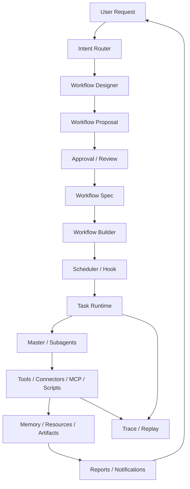

# Workflow Kernel Design

The Workflow Kernel is the next framework layer above the existing task runtime, skills, connectors, memory, and approvals.

It turns vague user requests into reviewed, durable, runnable workflows.

## Position In The Harness



## Request Intent

The first framework decision is not which tool to call. It is what class of work the request belongs to.

Initial intent types:

- `answer_now`: answer directly without durable workflow.
- `one_off_task`: run one bounded task and return a result.
- `deep_research`: gather sources and produce a report.
- `workflow_design`: interview the user and draft a workflow.
- `scheduled_workflow`: run recurring work on a cadence.
- `watcher_workflow`: long-running or frequent polling with alert conditions.
- `coding_workflow`: inspect, patch, test, and summarize a repository.
- `unknown`: ask one clarifying question.

The router should be deterministic-plus-model-assisted: deterministic keyword/shape checks first, then model classification when needed. The output must be structured and traceable.

## Workflow Lifecycle

Workflow specs move through explicit states:

```text
draft -> proposed -> approved -> active -> paused -> retired
                     \-> rejected
active -> unhealthy -> paused | retired
```

Workflow runs use task-like states:

```text
queued -> running -> waiting_for_input -> waiting_for_approval
running -> completed | failed | cancelled | unhealthy
```

Important rule: a workflow can be designed without being activated. Activation requires approval.

## Workflow Spec Shape

Minimum v1 fields:

- `workflow_id`, `version`, `name`, `description`
- `goal`, `success_criteria`
- `owner_channel`
- `status`
- `intent_type`
- `triggers`: manual, interval, cron, hook
- `inputs`: user-provided parameters and credential references
- `sources`: connectors, MCP servers, URLs, local roots, or generated scripts
- `steps`: ordered/event-linked operations
- `capabilities`: required tools/connectors/MCP/scripts and risk levels
- `policy`: approval requirements, rate limits, sandbox, retention
- `outputs`: resources, memory writes, artifacts, reports, notifications
- `evals`: fake fixtures or dry-run checks required before activation

Workflow specs should be JSON-compatible and persisted in SQLite. A later version can add YAML import/export, but v1 should keep the Python model simple.

## Step Types

Initial step types:

- `collect`: read from source connector or artifact.
- `dedupe`: identify already-seen items.
- `transform`: deterministic parsing or normalization.
- `analyze`: subagent/model-assisted reasoning over stored inputs.
- `aggregate`: keyword counts, trend grouping, rollups.
- `ask_user`: request missing design/runtime input.
- `approval`: pause until user approves a sensitive action.
- `call_tool`: invoke local typed tool.
- `call_connector`: invoke connector or MCP capability.
- `run_script`: execute reviewed generated artifact.
- `report`: render a markdown/html/text report.
- `notify`: send ntfy/web/mail notification.
- `subworkflow`: call another workflow spec.

Agents are used inside selected steps. The workflow engine owns control flow.

## Workflow Designer

The designer turns natural language into a proposal through a short interview loop.

Pipeline:

1. classify intent
2. extract candidate goal, cadence, source, output, and risk
3. identify missing required slots
4. ask exactly one high-value question at a time
5. draft proposal
6. run capability and policy review
7. request user approval
8. persist approved spec

The designer should prefer reusable primitives:

- use a connector/MCP when the external boundary is stable
- use a skill when the missing part is procedure
- generate a script only for source-specific glue or custom automation
- create a new tool only when the action is reusable and typed

## Builder And Runtime

The builder compiles `WorkflowSpec` into:

- task definitions
- schedule/hook registrations
- selected skills
- required capabilities
- approval gates
- artifact workspace
- run-time context seed

The runtime interprets step specs and delegates intelligence to agents only where needed. Deterministic steps should stay deterministic.

## Acceptance Probes

The first kernel milestone is not complete until these can be represented as workflow specs without bespoke architecture:

- "Read WSJ newsletters daily and report startup/portfolio signals."
- "Every 30 minutes, collect hot posts from a market community and report trend shifts."
- "Capture my idea from chat, link it to notes, and ask one follow-up question."
- "Watch this site and notify me when a target condition appears."
- "Inspect this repo, propose a scoped fix, patch, test, and report."

The implementation may use fake connectors/scripts for these probes. The point is spec expressiveness and lifecycle correctness.
